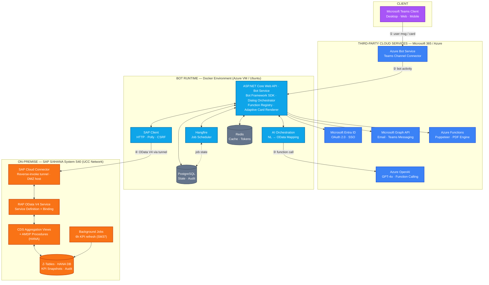

# System Architecture — AISO-Teams

**Project:** AI-Powered Microsoft Teams Chatbot for SAP Sales Order Task Management
**Version:** 1.2
**Last updated:** June 2026

---

## 1. Architectural Diagram

The system follows a hybrid cloud-to-on-premise pattern with four logical zones: the Microsoft Teams client, third-party cloud services (Microsoft 365 / Azure), the containerized .NET Bot Runtime, and the SAP S/4HANA on-premise backend at UCC.



The numbered flow ①–④ traces a single user query end-to-end through the system. A high-fidelity rendering of this diagram is provided in `architecture-v2.html` for inclusion in the thesis report and presentation slides.

## 2. Component Annotations

### 2.1 Client

**Microsoft Teams Client** — The primary user interface across desktop, web, and mobile. Users interact with the bot using natural language and receive structured responses via Adaptive Cards with embedded server-rendered chart images.

### 2.2 Third-Party Cloud Services

**Azure Bot Service** — The Teams channel connector. Teams clients do not call the Bot Runtime directly; all activities are routed through this managed service, which handles channel-specific protocol translation and delivery guarantees.

**Microsoft Entra ID** — Manages OAuth 2.0 single sign-on for users and service identities. Issues access tokens used by the bot to call Microsoft Graph and downstream services on behalf of the user.

**Azure OpenAI Service** — Hosts the GPT-4o model used to translate natural language queries into structured function calls. The function-calling API returns a function name plus parameters, which the bot validates and dispatches to the appropriate handler.

**Microsoft Graph API** — Used for outbound communication: distributing PDF reports via email and pushing proactive notifications to designated Teams channels.

**Azure Functions** — A serverless compute service hosting the Puppeteer-based PDF generation pipeline. Invoked by the Bot Service via HTTPS trigger; renders Adaptive Card data into well-formatted PDF documents.

### 2.3 Bot Runtime

**ASP.NET Core Web API · Bot Service** — The core orchestrator. Built on the Microsoft Bot Framework SDK, it manages dialog state, maintains the function registry, routes incoming user activities to handlers, and renders responses as Adaptive Cards.

**Hangfire** — Background job scheduler used for weekly report generation and threshold-based alert checks. Persists job state in PostgreSQL for reliability across restarts.

**AI Orchestration** — In-process module responsible for prompt construction, calling Azure OpenAI, parsing function-call responses, and mapping them to OData filter expressions.

**SAP Client** — Typed HTTP client wrapping all calls to the SAP OData service. Implements retry policies via Polly, CSRF token handling, and request logging.

**PostgreSQL** — Persistent relational storage for user mappings, conversation state, audit logs, and Hangfire job state.

**Redis** — Distributed cache for OData response caching and OAuth token storage with TTL-based expiry.

### 2.4 SAP S/4HANA On-Premise

**SAP Cloud Connector** — Runs on a dedicated host in the UCC DMZ. Establishes an outbound TLS tunnel to the Azure region hosting the Bot Runtime, allowing the cloud service to invoke the on-premise OData endpoint without exposing SAP to the public internet.

**RAP OData V4 Service** — Exposed via Service Definition and Service Binding, this is the externally consumable analytical OData endpoint. Read-only queries return aggregated KPI data; transactional actions (release, reject) use RAP behavior pool.

**CDS Aggregation Views & AMDP Procedures** — Core data modeling layer. Aggregation views combine VBAK, VBAP, LIPS, and related SD tables; AMDP procedures push heavy computations down to HANA SQLScript for performance.

**Z-Tables & HANA DB** — Custom tables `Z_AISO_KPI_SNAP`, `Z_AISO_KPI_LOG`, and `Z_AISO_AUDIT` store materialized KPI snapshots and audit records. Refreshed every six hours by a scheduled background job.

**Background Jobs** — SAP-side scheduled job (SM37) that recomputes KPI snapshots into the Z-tables on a six-hour cycle and logs the refresh timestamp for traceability.

---

## 3. Key Architectural Decisions

| Decision | Rationale |
|---|---|
| **Cloud Connector over public OData** | UCC does not expose S/4HANA to the public internet; Cloud Connector provides the standard SAP-supported pattern for outbound-only hybrid connectivity |
| **RAP service binding over SEGW** | S/4HANA-native, supports both analytical (read) and transactional (release/reject) operations from a single binding; aligns with current SAP best practice |
| **CDS + AMDP for aggregation** | Pushes computation to HANA, avoiding application-side aggregation; six-hour materialization balances freshness against cost |
| **Function calling over intent classification** | More accurate for structured query mapping; reduces hallucination by constraining LLM output to a schema; easier to test and version |
| **Azure Functions for PDF (serverless)** | Avoids hosting a heavy Puppeteer/Chromium binary in the main bot container; scales independently; cold start mitigated by warm-up ping |
| **Hangfire over Azure Logic Apps** | Stays inside the .NET process; simpler operational model for a capstone project; visible dashboard for demo |

---

## 4. Data Flow (End-to-End)

1. User sends message: `"kiểm tra đơn hàng 5001"`.
2. Teams -> Azure Bot Service -> `POST /api/messages` -> `TeamsBot.OnMessageActivityAsync()`.
3. `TeamsBot` calls `IFunctionDispatcher.DispatchAsync(message)`.
4. `AiServiceDispatcher` sends an HTTP POST request to the AI Microservice.
5. AI Microservice calls Azure OpenAI GPT-4o. GPT-4o identifies the intent (`check_order`) and returns a tool call: `CheckOrderStatus({"order_id": "0000005001"})`.
6. AI Microservice returns `AiOrchestratorResponse` to the .NET Backend.
7. `AiServiceDispatcher` iterates over `ToolCalls`, looking up `IFunction` in `IFunctionRegistry` by name (`CheckOrderStatus`).
8. `CheckOrderStatusFunction.ExecuteAsync()` is invoked. It queries `ISapClient` (or `MockSapClient`) for the order data.
9. `ExecuteAsync()` returns `FunctionResult.Ok(data)`.
10. `AiServiceDispatcher` returns a `DispatchResult` containing the payload to `TeamsBot`.
11. `TeamsBot` checks the payload type. If it's a list of `SalesOrder`, it builds an Adaptive Card using `SoSummaryCardBuilder`.
12. `TeamsBot` sends the Adaptive Card back to the user via Bot Framework.

## 5. Class Design (Bot Runtime)

### `IFunction`
The core interface for any executable action the AI can trigger.
```csharp
public interface IFunction
{
    string Name { get; }
    string Description { get; }
    string ParametersJsonSchema { get; }
    Task<FunctionResult> ExecuteAsync(JsonElement parameters, CancellationToken ct = default);
}
```

### `FunctionRegistry`
Holds all registered functions (`GetSalesOrders`, `CheckOrderStatus`, `ReleaseOrder`, etc.) and provides case-insensitive lookup.

### `IFunctionDispatcher`
Responsible for interpreting a user string and returning a `DispatchResult`. 
- `AiServiceDispatcher`: Primary implementation calling the Python microservice.
- `KeywordFunctionDispatcher`: Fallback implementation using Regex for local testing/development without AI.

---

**Document version:** 1.3
**Maintained by:** BE Lead (Trần Ngọc Quý Long)
