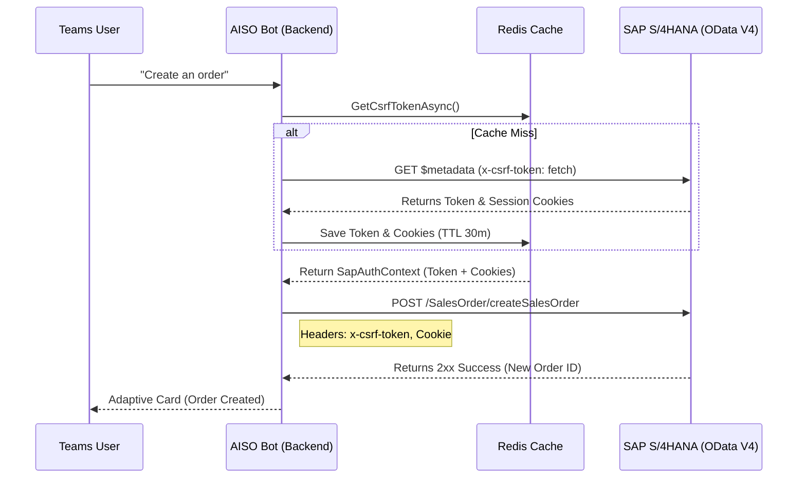

# Technical Specification: SAP Integration (Sprint 3)

## 1. Overview
Tài liệu này mô tả chi tiết kiến trúc tích hợp giữa Backend (AISO Teams Bot) và hệ thống SAP S/4HANA thông qua giao thức OData V4. Mục tiêu là để Bot có thể truy vấn dữ liệu Sales Order và thực thi các hành động (Create, Reject, Update Reference) với dữ liệu thật.

## 2. Architecture

## 3. Authentication & CSRF Token Flow
Hệ thống SAP bảo vệ các thao tác thay đổi dữ liệu (POST/PUT/DELETE) bằng cơ chế **CSRF (Cross-Site Request Forgery) Token** kết hợp với **Session Cookies**.
- **Lấy Token:** `SapTokenManager` gửi request `GET` kèm header `x-csrf-token: fetch` tới endpoint `$metadata`. SAP trả về token qua header `x-csrf-token` và session qua header `set-cookie`.
- **Cache:** Token và Cookies được serialize vào đối tượng `SapAuthContext` và lưu trữ tại **Redis** với thời gian sống (TTL) là 30 phút.
- **Sử dụng:** `SapClient` khi gọi các hàm Action sẽ tự động đính kèm Token và Cookies lấy từ Redis vào các Request Headers tương ứng.

## 4. OData Endpoints

Toàn bộ các tác vụ giao tiếp thông qua service RAP: `ZSB_AISO_SALES_ORDER_V4`.

### 4.1. Query Sales Orders
- **Endpoint:** `GET /SalesOrder`
- **Utility:** `ODataQueryBuilder` hỗ trợ xây dựng query string chuẩn xác với các tham số `$filter`, `$top`, `$skip`, `$expand`.

### 4.2. Actions (Bound Actions)
Dựa theo thiết kế behavior của SAP RAP, các action thao tác ghi đè/chỉnh sửa đơn hàng như sau:

| Action | HTTP Method | URL Suffix | Payload |
|---|---|---|---|
| **Create Order** | POST | `/SalesOrder/com.sap...createSalesOrder` | `DOC_TYPE`, `SALES_ORG`, `DIST_CHANNEL`, `DIVISION`, `CUSTOMER`, `CURRENCY`, `ITEMS` |
| **Cancel Order** | POST | `/SalesOrder('{id}')/com.sap...cancelOrder` | `REQUESTING_TEAMS_USER`, `REASON` |
| **Update Reference**| POST | `/SalesOrder('{id}')/com.sap...updateReference`| `REQUESTING_TEAMS_USER`, `NEW_REFERENCE` |

*(Note: Action `ReleaseOrder` và `ForwardOrder` chưa được team SAP cung cấp tính tới thời điểm Sprint 3 và tạm thời được Mock trong Backend).*

## 5. Resiliency (Polly Retry)
Các request gọi tới SAP OData được bọc bởi Polly WaitAndRetry policy (cấu hình trong `Program.cs`) nhằm xử lý tình trạng mạng chập chờn khi giao tiếp qua SAP Cloud Connector. Hệ thống sẽ tự động thử lại tối đa 3 lần với exponential backoff.
