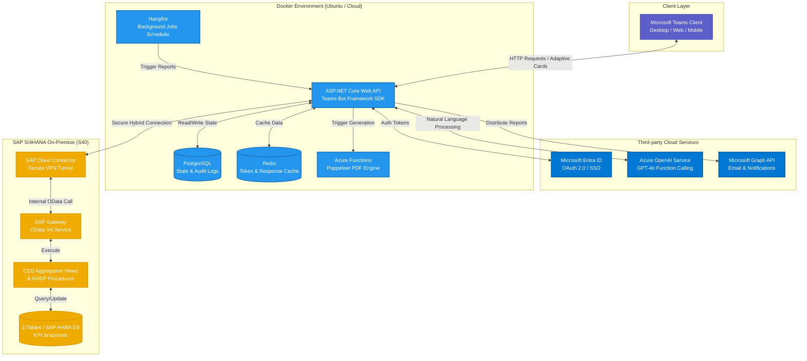

# System Architecture — AISO-Teams

**Project:** AI-Powered Microsoft Teams Chatbot for SAP Sales Order Task Management  
**Version:** 1.0  
**Status:** Active Development  

## 1. Architectural Diagram

Below is the high-level architecture diagram of the AISO-Teams system. It illustrates the hybrid cloud-to-on-premise connectivity between the Microsoft 365 ecosystem, Azure Cloud services, the containerized .NET Core Bot environment, and the SAP S/4HANA enterprise backend.

## 2. Component Annotations

### 2.1. Client Layer
* **Microsoft Teams Client:** The primary user interface. Users interact with the bot using natural language and receive structured data via Adaptive Cards with server-side rendered charts.

### 2.2. Third-Party Cloud Services
* **Microsoft Entra ID:** Manages Bot Framework Single Sign-On (SSO) and OAuth 2.0 token lifecycles with automatic refresh mechanisms.
* **Azure OpenAI Service:** Acts as the AI engine translating natural language queries into executable OData filter expressions via LLM Function Calling.
* **Microsoft Graph API:** Utilized for on-demand PDF report distribution and sending scheduled automated emails.

### 2.3. Docker Environment (.NET Core Backend)
* **ASP.NET Core Web API (Bot Service):** The core orchestrator. It handles Microsoft Bot Framework dialogs, manages conversational state, and maps user intents to backend actions.
* **PostgreSQL:** Persistent relational storage for user mappings, workflow state, and audit logs.
* **Redis:** Distributed cache layer for storing OData responses and maintaining rapid conversation state retrieval.
* **Azure Functions (Puppeteer):** A serverless microservice dedicated to generating well-formatted PDF documents from Adaptive Card data.
* **Hangfire:** Schedules automated background tasks, such as pushing weekly summaries to designated Teams channels and monitoring proactive alert thresholds.

### 2.4. SAP S/4HANA On-Premise
* **SAP Cloud Connector:** Provides a secure, reverse-invoked hybrid tunnel linking the cloud-hosted Bot Service to the internal SAP network.
* **SAP Gateway (OData V4):** Exposes pre-aggregated Sales Order KPIs securely to the Bot Service.
* **CDS Views & AMDP:** SAP's core data modeling frameworks used to compute heavy KPI aggregations (e.g., revenue, order aging) directly on the SAP HANA database.
* **Z-Tables:** Custom SAP tables storing KPI snapshots and audit trails for synchronization tracking.